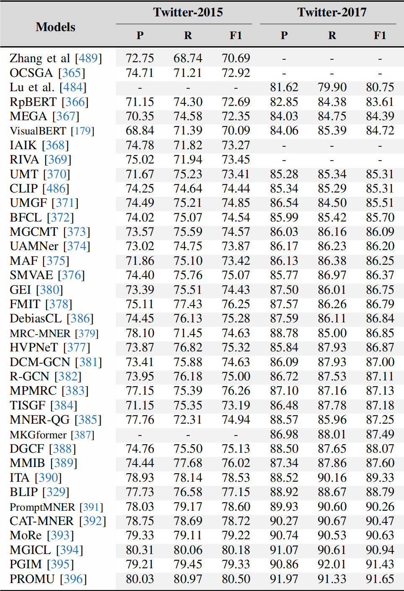

<div align="center"> 

## EKMM: 利用大模型增强多模态命名实体识别
</div>
<div align="center">
      简体中文| <a href="README_EN.md" >English</a>
  </div>

## 🕔目录
- [EKMM: 利用外部知识增强的多模态命名实体识别](#EKMM)
  - [项目介绍](#项目介绍)
  - [最近更新](#最近更新)
  - [TODO](#TODO)
  - [快速体验](#快速体验)
  - [得分](#得分)
  - [项目结构](#项目结构)
  - [部署](#部署)
  - [实现](#实现)

## 📠项目介绍
**介绍**

EMMM项目（利用大模型增强多模态命名实体识别）专注于通过整合大型语言模型作为动态外部知识源，目标是在各种多模态场景中实现更准确和高效的实体识别。

**背景**

多模态命名实体识别在理解复杂数据源中扮演着关键角色，特别是在社交媒体、新闻报道等领域。传统方法通常只依赖于有限的模态来识别实体，而忽视了外部大型知识库的潜力。此前也有项目尝试通过外部知识（wiki）增强实现任务，也很有效的打败了传统方法。基于前人的经验，我们提出了EKMM项目，EKMM通过融合文本和图像的数据，并结合外部模型生成的深层次知识，极大地提高了识别的准确性和鲁棒性。

## 🎇最近更新
- 【2024.4.25】项目立项
- 【2024.4.25】整理了twitter数据集，完成了数据预处理

## 🆙TODO

- 项目立项
- 数据整理与数据预处理
    - 整理不同领域的多种数据集
    - 完成数据预处理，包括数据清洗、数据增强
- 构建图片描述生成数据集
    - 使用统一的，效果好的模型，方便之后对不同LLM模型的效果进行对比。可能会使用[BLIP-2](https://github.com/huggingface/blog/blob/main/blip-2.md)
- 外部知识库构建
    - 构建外部知识库，包括实体、关系、事件等信息

- 使用XTuner对LLM模型进行微调(暂定基于数据集语言情况选择模型)
    - [llama3](https://github.com/InternLM/xtuner/tree/main/xtuner/configs/llama)
    - [InternLM](https://huggingface.co/internlm)
    - [Mixtral-8x7B](https://huggingface.co/mistralai)
    - [Llama 2](https://huggingface.co/)
    - [ChatGLM](https://huggingface.co/THUDM)
    - [Qwen](https://huggingface.co/Qwen)
    - [百川](https://huggingface.co/baichuan-inc) 
    

- 使用XTuner对VLM模型进行微调 
    - [LLaVA-InternLM2-20B](https://huggingface.co/xtuner/llava-internlm2-20b)
    - [llava-llama-3-8b](https://huggingface.co/xtuner/llava-llama-3-8b)

- 讨论`基于image caption + Multimodel Similar Example + LLM` 与`only VLM`的效果比较，并分析原因。

## 🔌快速体验
- 请阅读[快速体验](docs/quick_start.md)查阅

## 🌝得分
- 由该论文提供的[基准结果](https://github.com/zjukg/KG-MM-Survey?tab=readme-ov-file#multi-modal-named-entity-recognition)
<details>
    <summary>🔎 Benchmarks </summary>
<div align="center">
    
</div>
</details>


## 🎛项目结构
```
|-- README.md
|-- README_EN.md
|-- code
|   `-- ocr_module.py
|-- data
|   `-- twitter
|       |-- twitter2015
|       |   |-- test.txt
|       |   |-- train.txt
|       |   `-- valid.txt
|       `-- twitter2017
|           |-- test.txt
|           |-- train.txt
|           `-- valid.txt
|-- docs
|   `-- quick_start.md
`-- image
```
## 🔧部署

## 📌实现

### Requirements

```
python==3.7.10
```

### Data
- Twitter15_Twitter17数据集
  - 介绍：基于社交媒体的英文数据集。
  - text部分：`/data/twitter2015` and `/data/twitter2017`
  - image部分：[下载链接](https://pan.baidu.com/s/15JN6BK9RBXyeLKZMV2vkCw?pwd=mner)
- CMNER数据集
  - 介绍：基于社交媒体的中文 MNER 数据集。
  - text部分：`/data/cmner`
  - image部分：[下载链接](https://pan.baidu.com/s/1AFKSoSOT9xB1vobvaVkwCw?pwd=mner)

### OCR part
- 在此我们使用OCR文本检测与识别模型得到图片中更多的信息，包括文字、位置等信息。
- 在此使用通用领域中英都可以识别的的[读光-文字识别-行识别模型](https://www.modelscope.cn/models/iic/cv_convnextTiny_ocr-recognition-general_damo/summary)与[读光-文字检测-行检测模型](https://www.modelscope.cn/models/iic/cv_resnet18_ocr-detection-db-line-level_damo/summary)，具体请阅读[OCR部分](https://modelscope.cn/headlines/article/42)查阅。
- 代码实现于`/code/ocr_module.py`

### Image Caption part
- 在此我们使用[BLIP-2](https://github.com/huggingface/blog/blob/main/blip-2.md)模型生成图片描述。
- 代码实现于`/code/image_caption.py`

### Generate ft data
- 基于CMNER数据集和twitter数据集生成用于LLM微调的json数据集。
json格式为：
```
{
    "messages": [
        {
            "role": "user",
            "content": "请分析这段文本和对应的图片描述并完成实体识别的任务。这是对应图片的描述：‘一个男人坐在桌子前，拿着香奈儿的香水瓶’。
            这是需要识别的语句：‘香奈儿也玩虚假宣传’。这是需要检测出来的实体类型：时间，地点，涉及金额，监管机构，产品名称，产品类别，产品品牌。
            "
        },
        {
            "role": "assistant",
            "content": "['产品品牌': '香奈儿']"
        }
    ]
},
```
- 代码实现于`/code/generate_ft_data.py`